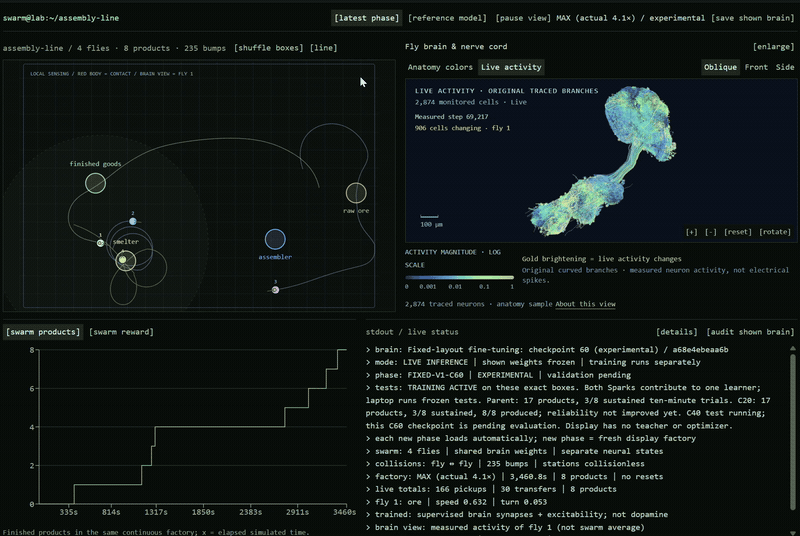

# Using Fruit Fly Connectome To Control Logistic Drones to Service Logistic Network without Encoding Topology of the Network.

TLRD: The vitrual brain of a fruit fly is trained to make deliveries for a factory assembly line. It's not as efficient as drones with knowledge of the map but it works, so as a proof of concept we might be able to mmeaningfully use simulated brains to power machines.

**What is Achieved**
We connects a full released MaleCNS neuronal graph to simple 2D avatars, trains selected model parameters, and makes the resulting behavior inspectable alongside anatomical neuron reconstructions and measured activity.

The drone, all sharing one instance of a trained brain, learned whole-line service and a productive four-fly swarm were demonstrated on the original layout. Service on arbitrary layouts was achieveable but realiability still depends on the layout of the logistic network.



This 60-second animated GIF compresses approximately 59 minutes of recorded dashboard playback.

## Why Do This
Deciding how to get from point A to point B though multiple intermediate stops, also known as the routing problem, exist in multiple disciplines like computer networks, logistics, and mathematics. The idea is that if a swarm of drones, each having only only knowledge of the map can self-organize to service the network to deliver messages or cargos, then we can reduce the computational workload of determining the optimal route and rely on the agents to learn it through training, not through coding, making the network more resilent to changing positions of the nodes without crashing the system.

The project includes:

- A sparse recurrent rate model using **166,700 retained neurons and 25,582,938 directed neuron-pair connections**, representing 124,177,617 released synaptic contacts.
- A continuous 20 × 14 plane, material carrying, processing stations, final-product delivery, and continuous production without resetting after every delivery.
- Four-fly scenarios with circular body collisions; the boxes remain collisionless.
- Fixed projections into annotated sensory neurons and a fixed readout from selected descending/motor neuron populations.
- Dopamine-inspired plasticity experiments, later supervised synaptic training, distributed workers, frozen evaluations, and diagnostic experiments.
- A React/Three.js dashboard showing the factory, trails, production/reward history, checkpoint identity, and anatomically traced neuron branches with activity overlays.
- Tests, retained evaluation reports, preparation tools, and two separately packaged model snapshots: the original-layout reference and the final displayed experimental model.

This is a **connectome-constrained engineering model**, not a validated digital replica of a living fly. The MaleCNS release contains brain and ventral nerve cord data; “brain” is shorthand throughout the app. Geometry and connectivity do not establish biological dynamics, cognition, or behavior. The neuron counts above describe this project's explicit retention policy, not a claim that every cell in the animal has been simulated.

## How it works

```text
Local 2D observations → fixed sensory projection → full recurrent connectome
                                                        ↓
                               fixed descending/motor readout
                                                        ↓
                                forward speed, turn, interact
                                                        ↓
                               body, cargo and shared factory
```

The prepared graph is a signed, input-normalized sparse matrix. Connection magnitudes originate from released contact counts; signs use a simplified neurotransmitter convention. Recurrent rate updates operate on the full retained graph. These are numerical rate-model states, **not action potentials**. There is no spiking membrane model or simulated muscle biomechanics.

The embodied controller reads DNg100 for forward drive, left/right DNa02 populations for turning, and MN9 for the interaction channel. The mapping of MN9 activity to cargo handling is an artificial interface, not a claim about its natural function. Physics translates these outputs into bounded continuous movement and context-dependent pick/drop operations. A fly has a position, orientation, radius and cargo state, rather than an articulated insect body.

The successful reference used 30 engineered sensory channels. Later layout experiments extended the fixed local interface to include box identity, carried material and visible stock/status; the latest interface has 297 channels. It does not provide a global route or target coordinate. These interfaces are **not interchangeable**, and checkpoints are checked against graph/interface fingerprints.

For the final brain-only experiments, decision-making stays within the existing connectome plus the fixed output mapping: no auxiliary learned attention network, learned action decoder, or path planner chooses inference-time actions. Teacher logic is used to construct training labels, not to drive the evaluated avatar.

## How we trained it—and what changed along the way

### 1. Establish a working simulator and a compute baseline

The first version used a full-graph reservoir with a learned encoder/readout and actor–critic training. Independent factories supplied batched experience; multiple flies in one factory instead introduced shared inventory and physical interaction. Those are different experiments, not equivalent ways of increasing batch size.

A laptop GPU and two DGX Sparks were connected to a shared learner. Versioned contributions, bounded staleness and checkpoint recovery helped keep workers coordinated. Short tests of that **early controller** measured 2,730 actions/s with two Sparks and 3,258 actions/s when the laptop joined, a 19.3% increase. These figures are not benchmarks of the later all-synapse learner and do not measure learning quality.

### 2. Replace the learned interface with an explicit embodiment

The owner wanted sensory neurons connected to the plane, motor-related neurons connected to the avatar, and learning inside the brain. We built a fresh untrained embodiment and fixed those interfaces. We then tried an engineered three-factor plasticity rule: presynaptic activity, postsynaptic/exploratory eligibility, and a dopamine-related modulation signal driven through selected annotated populations.

This produced a measurable **pickup skill**, but not whole-line service. In a matched 64-world frozen test, the original model made no pickups; the learned model made 75 pickups and 11 transfers, but **zero finished products**. A separate near/far test and no-dopamine/blanked-sense controls helped distinguish useful change from noise.

Plasticity initially covered selected incoming connections; it was subsequently expanded so all existing synaptic strengths could change. Existing routes and signs remained fixed. Making more parameters trainable did not, by itself, solve long-horizon credit assignment.

### 3. Use supervised recurrent training for the difficult sequence

We moved to **backpropagation through recurrent neural dynamics**, optimizing per-connection log gains. This is an explicit departure from dopamine-only learning. The successful reference is not evidence that the dopamine rule learned the whole assembly line.

A geometric teacher generated desired motor outputs from training-world situations. The student retained its own recurrent state and executed its own actions. Training mixed approach, carry, pickup, delivery and recovery examples. Truncated backpropagation across eight physical actions (32 neural substeps) and replay of earlier skills improved sequence retention.

Sparse matrix derivatives were computed edge-by-edge in chunks rather than materializing a dense neuron-by-neuron gradient matrix. The graph topology, sign convention, original sensory projection and decoder were fixed. All 25,582,938 gains were eligible for updates; the selected reference changed 25,035,462 of them. Later layout candidates also trained existing neuronal tonic drive/excitability.

### 4. Select models by frozen behavior, not training loss

We retained checkpoints, disabled teacher assistance, exploration and updates, and compared models on matched fresh world seeds. Product completion, repeated production, transfer counts and late-run activity were the acceptance evidence. Checkpoint and interface hashes were recorded. A later checkpoint could perform worse and was not automatically promoted as “best.”

### 5. Extend to a colliding swarm, then challenge layout generalization

Four independent neural states sharing the original-layout reference weights could service the line without additional swarm training in the tested setup. Generalizing to scattered boxes was much harder. We added explicit local identity/cargo/status cues, randomized curricula, recurrent demonstrations, on-policy corrections, transition-focused replay and many gradient/credit-assignment diagnostics.

The owner explicitly rejected an auxiliary learned perception/attention controller. We preserved that constraint. Arbitrary-layout reliability remained unresolved, despite improvements on some local diagnostic tasks.

## Challenges and what we did about them

| Challenge | Response | What it established |
|---|---|---|
| Reward arrives well after the action that helped | Eligibility traces, intermediate task signals, then sequence supervision and replay | Pickup learned first; recurrent supervision was needed for the demonstrated whole-line result |
| Training loss improved while behavior failed | Frozen paired-seed evaluations; report products and sustained service separately | Lower loss or higher shaped reward is not sufficient evidence of competence |
| Static steering examples failed in continuous runs | Neural warm-up, retained recurrent state, and multi-step training | Saturation and state history mattered; orientation alone was not navigation |
| New learning damaged earlier skills | Replay, task-balanced sampling, bounded phases and checkpoint comparison | Some regressions were caught; forgetting was not fully eliminated |
| Box roles were ambiguous to the original senses | Fixed local color/role, cargo and status channels into existing sensory cells | Reduced input ambiguity without adding a learned decision network; did not solve arbitrary layouts |
| Flies returned items immediately or stalled | Interaction traces, transition/recovery curricula and per-fly contribution metrics | Exposed failure modes hidden by aggregate reward and occasional deliveries |
| Full-graph training was expensive | Sparse CSR operations, chunked gradients, batches and distributed workers | More useful throughput without pretending multiple machines pool into one GPU |
| Fast simulation looked jerky in the browser | Timestamped motion buffers, interpolation and lock-free published snapshots | Smoother display without increasing the physics step or inventing motion |
| “Brain wiring” initially looked schematic | Real SWC reconstructions, branch-preserving simplification and provenance hashes | Anatomical curves rather than straight invented soma-to-soma paths |
| Activity looked like decorative flashing | Sample actual recurrent activity and weighted presynaptic signals; tie highlights to measurements | Measured rate activity for a selected sample, not biological spikes or every synapse |

## Results: what worked and what did not

These are retained experiment results, **not newly rerun benchmarks**. Different rows use different model stages, interfaces or protocols; they must not be pooled into a single success rate.

| Experiment | Frozen evaluation | Outcome |
|---|---|---|
| Dopamine-inspired pickup | 64 fresh worlds, 40 simulated seconds | 75 pickups, 11 transfers, **0 final products**; original model: 0/0/0 |
| Supervised steering | 128 fresh steering trials | 128/128 passed the heading criterion; did **not** establish forward navigation |
| Original-layout, single-fly finite service | 64 paired factories, 3 items each, 240 seconds | Complete factories improved **49/64 → 62/64**; products **159 → 190** of 192 |
| Original-layout continuous supply | 32 paired factories, 240 seconds | Products **95 → 115** (+21.1%); some individual worlds regressed |
| Original-layout, four colliding flies | 16 fresh worlds, 600 seconds | **410 products**, 19–31 per world; all 16 produced in the second half, 15/16 in the last minute |
| Later fixed-layout development baseline | 8 worlds, 600 seconds, revised interface/physics | 17 products; sustained-service criterion met in **3/8** worlds |
| Later FIXED-V2-C20 | Same paired development protocol | 12 products; sustained service in **1/8** worlds |
| Later FIXED-V2-C40 | Same paired development protocol | 19 products; sustained service in **3/8** worlds—no demonstrated reliability breakthrough |
| Last displayed FIXED-V2-C60 | Checkpoint identity validated | **No completed independent behavioral validation** in this snapshot |

The reference swarm encountered 1,055 bump events; minimum measured separation was approximately 0.44000047 for a 0.44 body diameter. That supports the collision implementation in these trials, not a guarantee of jam-free operation forever.

The original-layout reference had only one training seed. The latest eight-world tests were development tests, not a fresh final holdout. A “sustained” later-layout trial requires at least three products and production in the second half; it is not synonymous with any pickup or one delivery. See [retained results](docs/RESULTS.md) and their machine-readable evidence.

**End result:** a functioning research sandbox with a full retained connectome, genuine traced anatomy, measurable learning, successful narrow-layout swarm logistics, and an honest unresolved generalization problem. It is not a general factory agent, a Factorio integration, or a biological proof of fly intelligence.

## Visualization: what the lines mean

The browser renders **2,874 sampled neuron skeletons**, about 6.56 million simplified branch segments, from the MaleCNS SWC data. Original branch topology and coordinates are retained with a documented 0.2 μm simplification tolerance. This is a sampled anatomical view, not all 166,700 neurons rendered at once.

The later viewer samples measured rate activity and connection signals for the selected fly. A weighted presynaptic signal is computed from the actual tensor entering a recurrent update. Its highlight is overlaid on traced anatomy. A branch highlight is **not** a measurement of propagation along each axonal compartment, and neuron-pair connectivity does not locate individual synapses on branches. Browser interpolation and sampling also mean the view is not a frame-by-frame display of every neural operation.

## Run it

Start with [setup and model artifacts](docs/SETUP.md). The dashboard needs Node.js ≥22.13 and a browser with WebGL. The full model paths require a compatible CUDA-enabled PyTorch installation; the original laptop used an RTX 5090 Laptop GPU. DGX Spark needs an ARM64/GB10-compatible runtime, not the Windows environment copied over.

```sh
npm ci
npm run dev
```

Open `http://localhost:5173`. The page alone does **not** run the brain: launch a frozen Python viewer as described in the setup guide, or it will report the local service as unavailable. Model inference runs locally; static web hosting and GitHub Pages do not supply GPU compute.

```sh
npm test
npm run typecheck
python scripts/test-smoke.py
```

The smoke suite uses small fixtures, not a live learner. Full scientific reproduction additionally requires the public data, the correct checkpoint/interface and controlled GPU evaluation. See [architecture and training](docs/ARCHITECTURE.md), [verification](docs/VERIFICATION.md), and [security](SECURITY.md).

## Repository map

```text
app/, components/, lib/      Dashboard, anatomical view and streaming playback
engine/                     Brain models, physics, training, evaluation, tests
scripts/                    Data/morphology preparation and browser tests
public/anatomy/             Attributed sampled SWC-derived browser assets
docs/results/               Retained, sanitized evaluation evidence
docs/media/                 Dashboard still and 60-second GIF
artifacts/manifest.json     Runtime/model inventory and SHA-256 checksums
.github/workflows/          Source-level CI; not a GPU-training scheduler
```

This is a clean source snapshot, including the latest formerly uncommitted experiments. Personal credentials, SSH addresses, machine-specific launch state, raw desktop recordings, dependencies and the earlier hosting Git history are excluded. The large prepared graph and selected checkpoints travel in a separate runtime archive. Historical checkpoints, all raw rollouts, optimizer states and remote temporary directories are **not** exhaustively archived here; this is not a bit-exact resume of every experiment.

## Data, attribution and scope

The source data is [MaleCNS v1.0](https://male-cns.janelia.org/download/), by FlyEM/HHMI Janelia and collaborators at the University of Cambridge, MRC Laboratory of Molecular Biology and Google Research, distributed under [CC BY 4.0](https://creativecommons.org/licenses/by/4.0/). This project filters the neuronal graph, assigns model weights and simplifies a sampled set of skeletons; those changes are ours, not biological measurements supplied by the data authors. No endorsement is implied.

The sparse-learning investigation was informed by public connectome-control demonstrations, including [Flyhard](https://github.com/MarkUnthank/flyhard); this project is not a reproduction or benchmark comparison with those demonstrations. Repository behavior and quantitative claims are grounded in the included source and local experiment evidence.

See [third-party notices](THIRD_PARTY_NOTICES.md). No open-source license has yet been selected for the project's original code. The dataset and bundled third-party materials retain their own licenses.
